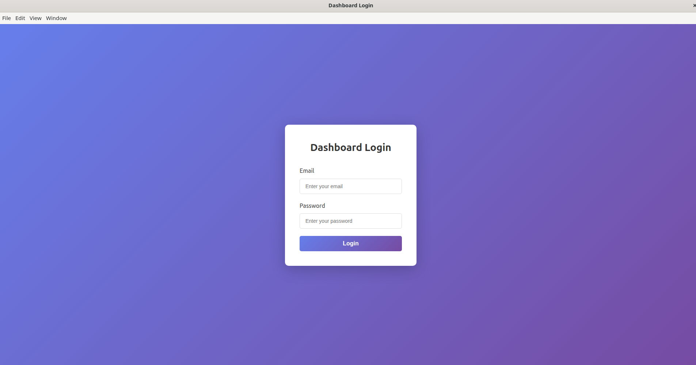
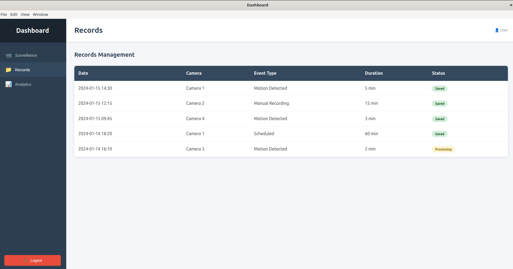

# Desktop Dashboard App
# 🚀 Dashboard App (Linux .deb)

A professional, fundamental frontend dashboard for Ubuntu Linux. This application features a secure login flow followed by a multi-section dashboard containing Surveillance, Records, and Analytics.

---

## 🧠 Key Concepts

* **Electron:** A framework that allows you to build desktop applications using web technologies (HTML, CSS, and JavaScript). It combines the Chromium rendering engine and the Node.js runtime.
* **Electron-Builder:** A complete solution to package and build a ready-for-distribution Electron app. In this project, it is used to compile the code into a Linux `.deb` installer.
* **Renderer Process:** This is the "Frontend" of your app. Every window in Electron runs a web page in a separate process called the Renderer. It handles the UI and user interactions.
* **IPC (Inter-Process Communication):** A secure messaging system that allows the **Renderer** (UI) and the **Main** (System) processes to communicate with each other. For example, it sends login credentials from the UI to the system for validation.

---

## 📂 Project Structure

Ensure your directory is organized as follows:

```
dashboard-app/
├── package.json          # Project metadata and build configurations
├── main.js               # Electron Main Process (System-level logic)
├── preload.js            # Secure bridge between Main and Renderer
├── renderer.js           # Frontend logic for section switching
├── styles.css            # Styling for Login and Dashboard
├── index.html            # Login Page (Frontend)
├── dashboard.html        # Main Dashboard Page (Frontend)
├── build/
│   └── icon.png          # App icon for the Linux launcher
└── screenshots/          # Folder for your documentation images
    ├── login.png
    └── dashboard.png
```

---

## 📸 Demonstration

| Login Page | Dashboard View |
| :--- | :--- |
|  |  |

---

## 🛠️ How to Execute

### 1. Install Dependencies

Open your terminal in the dashboard-app folder and run:

```bash
npm install
```

### 2. Run in Development Mode

To test the application and view the UI:

```bash
npm start
```

**Login credentials for testing:**
- Email: `any@email.com`
- Password: `anypassword` (minimum 6 characters)

### 3. Build the .deb Installer

To package the app into a professional Linux installer:

```bash
npm run build
```

### 4. Install the App on Ubuntu

Once the build is finished, find the .deb file in the `dist/` folder and install it using:

```bash
sudo dpkg -i dist/dashboard-app_1.0.0_amd64.deb
```

---

## ⚙️ Features

- **Login Authentication:** Simple email/password validation via IPC.
- **Dynamic Sections:** Seamless switching between Surveillance, Records, and Analytics without reloading the page.
- **Linux Native:** Integrated with the Ubuntu desktop environment via a standalone window.

---

## 📋 Prerequisites

- **Node.js** (v14 or higher)
- **npm** (v6 or higher)
- **Ubuntu/Debian-based Linux distribution**

---

## 🚀 Quick Start

```bash
# Clone or navigate to your project
cd dashboard-app

# Install dependencies
npm install

# Run in development mode
npm start

# Build for distribution
npm run build

# Install the generated .deb file
sudo dpkg -i dist/dashboard-app_1.0.0_amd64.deb
```

---

## 🔒 Security Notes

- The preload.js file acts as a secure bridge between the Main and Renderer processes.
- IPC communication should validate all data sent from the Renderer process.
- Keep sensitive logic (like password validation) in the Main process, not the Renderer.

---
